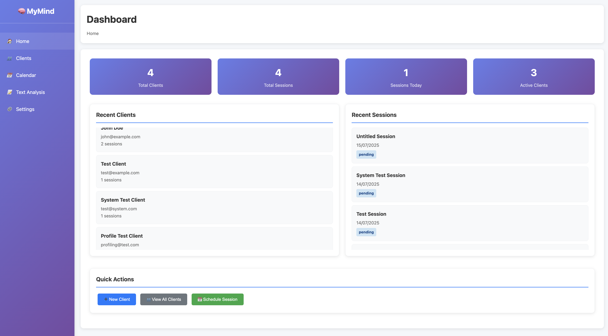

# MyMind - Therapeutic AI Application



A comprehensive AI-powered therapeutic support system that processes audio sessions, extracts insights, and provides real-time therapeutic analysis.

## Architecture Overview

```
├── data/                          # Data storage
│   ├── raw_audio/                # Raw audio files from therapy sessions
│   ├── transcripts/              # Text transcripts
│   └── processed_data/           # Processed analysis results
├── src/
│   ├── input_processing/       # Audio transcription and speaker diarization
│   │   └── speech_to_text/       # Whisper-based transcription
│   ├── preprocessing/          # Text processing pipeline
│   │   └── llm_processing/       # GPT-4.1-nano keyword extraction and sentiment
│   ├── analysis/               # Core analysis engine
│   │   ├── nlp/                  # Natural language processing
│   │   │   └── graph_construction/  # UMAP/t-SNE embedding visualization
│   │   ├── rag/                  # LangChain RetrievalQA system
│   │   └── therapeutic_methods/  # CBT/schema therapy evaluations
│   ├── profiling/              # Client profiling system
│   │   └── needs_assessment/     # Trajectory summarization
│   ├── output/                 # Report generation
│   ├── api/                    # FastAPI gateway
│   │   └── routers/              # API endpoints
│   ├── database/               # SQLModel database layer
│   └── common/                   # Shared utilities
└── ui/                           # React user interface
    ├── dashboard/                # Analysis dashboard
    ├── chat/                     # Interactive chat interface
    └── profile/                  # Client profile management
```

## Key Components

### 1. Input Processing
- **Whisper Large-v3**: High-quality speech-to-text transcription
- **Pyannote**: Speaker diarization for therapist/client separation
- **Word-level timestamps**: Precise temporal mapping

### 2. Preprocessing Pipeline
- **GPT-4.1-nano**: Keyword extraction and sentiment analysis
- **JSON-structured output**: Temporal keyword mapping
- **PostgreSQL storage**: Efficient data persistence

### 3. Analysis Engine
- **Embedding Visualization**: UMAP/t-SNE for concept mapping
- **RAG System**: LangChain-based knowledge retrieval
- **Therapeutic Methods**: CBT and schema therapy evaluations
- **Cognitive Distortion Detection**: Automated pattern recognition

### 4. Profiling System
- **Needs Assessment**: Universal client profiling
- **Trajectory Analysis**: Session-to-session progress tracking
- **Therapeutic Metrics**: Stress, mood, and progress indicators

### 5. Output Layer
- **Streaming Reports**: Real-time GPT-4.1-nano analysis
- **Markdown Generation**: Structured therapeutic insights
- **Priority Scoring**: Issue ranking and recommendations

### 6. API Gateway
- **FastAPI**: High-performance async endpoints
- **Session Management**: UUID-based session tracking
- **Streaming Support**: Real-time data processing

### 7. Database Layer
- **SQLModel**: Type-safe database interactions
- **PostgreSQL**: JSONB support for flexible data storage
- **Session Indexing**: Optimized query performance

## 🚀 Quick Start

### Prerequisites
- Python 3.8+
- Virtual environment (recommended)

### Installation & Setup

1. **Clone and Navigate**
   ```bash
   cd /Users/ivanculo/Desktop/Projects/MyMind
   ```

2. **Create Virtual Environment**
   ```bash
   python3 -m venv venv
   source venv/bin/activate  # On Windows: venv\Scripts\activate
   ```

3. **Install Dependencies**
   ```bash
   pip install -r requirements.txt
   ```

4. **Initialize Database**
   ```bash
   python init_db.py
   ```

5. **Start Server**
   ```bash
   python run_therapy_admin.py
   ```

6. **Access Application**
   - **Main Admin UI**: http://localhost:8000
   - **Analysis UI**: http://localhost:8000/analysis
   - **API Documentation**: http://localhost:8000/docs
   - **Health Check**: http://localhost:8000/health

## Technology Stack

- **AI/ML**: OpenAI GPT-4.1-nano, Whisper, Pyannote, UMAP
- **Backend**: FastAPI, SQLModel, PostgreSQL
- **Frontend**: React, TypeScript, Tailwind CSS
- **Infrastructure**: Docker, Alembic migrations

## Development Workflow

1. **Audio Processing**: Upload therapy session audio
2. **Transcription**: Whisper converts speech to timestamped text
3. **Analysis**: GPT-4.1-nano extracts keywords and therapeutic insights
4. **Visualization**: UMAP creates concept relationship maps
5. **Profiling**: Track client progress and therapeutic outcomes
6. **Reporting**: Generate streaming therapeutic reports
